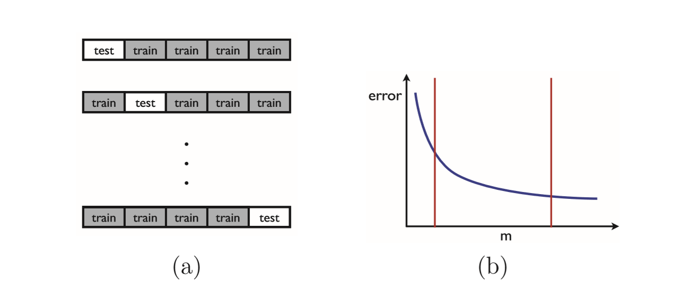

## 1 Introduction
Machine learning can be broadly defined as computational methods using experience to improve performance or to make accurate predictions. 

机器学习可以被广泛地定义为使用经验来提高性能或做出准确预测的计算方法。

- accurate adj. 正确无误的;精确的;准确的;准确的(掷、射、击等)
- prediction n.预言;预测;预告

Here, experience **refers  to** the past information **available to** the learner, which typically **takes the form of** electronic data collected and made available for analysis. 

在这里，经验是指学习者可以获得的过去的信息，这些信息通常以收集并提供用于分析的电子数据的形式出现。

- takes the form of 以...方式出现
- refers to ...是指...
- available to 可获得的

This data could be in the form of digitized human-labeled training sets, or other types of information obtained via interaction with the environment. 

这些数据可以是数字化的人工标记训练集的形式，也可以是通过与环境交互获得的其他类型的信息。

- via prep.经由，经过(某一地方);通过，凭借(某人、系统等)

In all cases, its quality and size are crucial to the success of the predictions made by the learner. 

在所有情况下，它的质量和大小对学习者做出的预测的成功至关重要。

Machine learning consists of **designing efficient** and **accurate prediction algorithms**.

机器学习包括设计高效和准确的预测算法。

 As in other areas of computer science, some critical measures of the quality of these algorithms are their time and space **complexity**.

与计算机科学的其他领域一样，衡量这些算法质量的一些关键指标是它们的时间和空间复杂性。

- complexity 复杂度

 But, in machine learning, we will need additionally a **notion** of sample complexity to evaluate the sample size required for the algorithm to learn a family of concepts. 

但是，在机器学习中，我们还需要一个**样本复杂性**的概念来评估算法学习一系列概念所需的样本量。

- notion 概念

More generally, theoretical learning guarantees for an algorithm depend on the complexity of the concept classes considered and the size of the training sample.

一般来说，算法的理论学习保证取决于所考虑的概念类的复杂性和训练样本的大小。

- guarantee 保证
- theoretical learning guarantees for an algorithm 算法的理论学习

 Since the success of a learning algorithm depends on the data used, machine learning is inherently related to data analysis and statistics. 

由于学习算法的成功取决于使用的数据，机器学习本质上与数据分析和统计有关。

- inherently adv.内在的，天性地，固有地 

More generally, learning techniques are data-driven methods combining fundamental concepts in computer science with ideas from statistics, probability and optimization.

更一般地说，学习技术是数据驱动的方法，将计算机科学中的基本概念与统计、概率和优化的思想结合起来。

- optimization n.优化

### 1.1 Applications and problems
Learning algorithms have been successfully deployed in a variety of applications, including

学习算法已成功地部署在各种应用程序中，包括

- Text or document classification, e.g., spam detection; 
- 文本或文档分类，例如垃圾邮件检测；
- Natural language processing, e.g., morphological analysis, part-of-speech tagging, statistical parsing, named-entity recognition; 
- 自然语言处理，如形态分析、部分语音标记、统计分析、命名实体识别；
- Speech recognition, speech synthesis, speaker verification; 
- 语音识别、语音合成、扬声器验证；
- Optical character recognition (OCR); 
- 光学字符识别（OCR）；
- Computational biology applications, e.g., protein function or structured prediction;
- 计算生物学应用，例如蛋白质功能或结构化预测；
- Computer vision tasks, e.g., image recognition, face detection; 
- 计算机视觉任务，如图像识别、人脸检测；
- Fraud detection (credit card, telephone) and network intrusion;
- 欺诈检测（信用卡、电话）和网络入侵；
- Games, e.g., chess, backgammon;
- 游戏，如国际象棋、双陆棋；
- Unassisted vehicle control (robots, navigation);
- 无辅助车辆控制（机器人、导航）；
- Medical diagnosis; 
- 医学诊断；
- Recommendation systems, search engines, information extraction systems. 
- 推荐系统，搜索引擎，信息提取系统。

This list is by no means comprehensive, and learning algorithms are applied to new applications every day. 

这个列表决不是全面的，学习算法每天都应用于新的应用程序。

Moreover, such applications correspond to a wide variety of learning problems.

此外，这种应用程序对应于各种各样的学习问题。

 Some major classes of learning problems are: 

一些主要的学习问题是：

- *Classification*: Assign a category to each item. For example, document classification may assign items with categories such as politics, business, sports, or weather while image classification may assign items with categories such as landscape, portrait, or animal. The number of categories in such tasks is often relatively small, but can be large in some difficult tasks and even unbounded as in OCR, text classification, or speech recognition. 

- 分类：为每个项目分配一个类别。例如，文档分类可以为项目分配政治、商业、体育或天气等类别，而图像分类可以为项目分配景观、肖像或图像等类别。这类任务中的类别数量通常相对较少，但在一些困难的任务中可能较大，甚至在OCR、文本分类或语音识别中也不受限制。

   + Assign  分配

- *Regression*: Predict a real value for each item. Examples of regression include prediction of stock values or variations of economic variables. In this problem, the penalty for an incorrect prediction depends on the magnitude of the difference between the true and predicted values, in contrast with the classification problem, where there is typically no notion of closeness between various categories. 

- 回归：预测每个项目的实际值。回归的例子包括股票价值的预测或经济变量的变化。在这个问题中，错误预测的惩罚取决于真实值和预测值之间差异的大小，与分类问题不同，分类问题通常不存在不同类别之间的紧密性概念。

  + magnitude n.巨大;重大;重要性;星等;星的亮度;震级

- *Ranking*: Order items according to some criterion. Web search, e.g., returning web pages relevant to a search query, is the canonical ranking example. Many other similar ranking problems arise in the context of the design of information extraction or natural language processing systems.

- 排序：根据某种标准对项目进行排序。Web搜索（例如返回与搜索查询相关的网页）是规范的排名示例。在信息提取或自然语言处理系统的设计中，也出现了许多类似的排序问题。

  + criterion 标准
  + canonical 规范的

- *Clustering*: Partition items into homogeneous regions. Clustering is often performed to analyze very large data sets. For example, in the context of social network analysis, clustering algorithms attempt to identify “communities” within large groups of people. 

- 聚类：将项目划分为均匀区域。聚类通常用于分析非常大的数据集。例如，在社会网络分析的背景下，聚类算法试图识别大群体中的“社区”。

  + partition 分割
  + homogeneous 同类的

- *Dimensionality reduction or manifold learning*: Transform an initial representation of items into a lower-dimensional representation of these items while preserving some properties of the initial representation. A common example involves preprocessing digital images in computer vision tasks. 

- 降维或流形学习：将项目的初始表示转换为这些项目的低维表示，同时保留初始表示的一些属性。一个常见的例子涉及计算机视觉任务中的数字图像预处理。

  + manifold 多

  The main practical objectives of machine learning consist of generating accurate predictions for unseen items and of designing efficient and robust algorithms to produce these predictions, even for large-scale problems. To do so, a number of algorithmic and theoretical questions arise. Some fundamental questions include:

  机器学习的主要实践目标包括生成对未知项的精确预测，设计高效和强大的算法来生成这些预测，即使是针对大规模问题。为此，出现了许多算法和理论问题。一些基本问题包括：

  + practical objectives 实践目标
  + produce 生产

  

   **Figure 1.1** The zig-zag line on the left panel is consistent over the blue and red training sample, but it is a complex separation surface that is not likely to generalize well to unseen data.

  图1.1左面板上的之字形线与蓝色和红色训练样本一致，但它是一个复杂的分离面，不太可能很好地概括为看不见的数据。

  In contrast, the decision surface on the right panel is simpler and might generalize better in spite of its misclassification of a few points of the training sample.

  相比之下，右面板上的决策面更简单，尽管它对训练样本的几个点进行了错误分类，但其概括性可能更好。

  + decision surface 决策面
  +  in spite of 尽管

  Which concept families can actually be learned, and under what conditions? How well can these concepts be learned computationally?

  哪些概念家庭实际上可以学习，在什么条件下？这些概念在计算上能学得多好？

### 1.2 Definitions and terminology

  We will use the canonical problem of spam detection as a running example to illustrate some basic definitions and to describe the use and evaluation of machine learning algorithms in practice.

  我们将使用垃圾邮件检测的规范问题作为一个运行示例来说明一些基本定义并描述机器的使用和评估在实践中学习算法。

  + canonical 规范的

   Spam detection is the problem of learning to automatically classify email messages as either spam or non-spam.

  垃圾邮件检测是学习自动将电子邮件分类为垃圾邮件或非垃圾邮件。

- *Examples*: Items or instances of data used for learning or evaluation. In our spam
    problem, these examples correspond to the collection of email messages we will use
    for learning and testing.

- 示例：用于学习或评估的数据项或实例。在我们的垃圾邮件中问题，这些示例对应于我们将使用的电子邮件的集合用于学习和测试。

- *Features*: The set of attributes, often represented as a vector, associated to an example. In the case of email messages, some relevant features may include the length of the message, the name of the sender, various characteristics of the header, the presence of certain keywords in the body of the message, and so on. 

- 特征：与一个例子相关联的一组属性，通常表示为向量。对于电子邮件，一些相关功能可能包括邮件的长度、发件人的姓名、邮件头的各种特征、邮件正文中存在某些关键字等。

    + presence 存在 

- *Labels*: Values or categories assigned to examples. In classification problems, examples are assigned specific categories, for instance, the spam and non-spam categories in our binary classification problem. In regression, items are assigned real-valued labels.

- 标签：指定给示例的值或类别。在分类问题中，示例被指定为特定类别，例如，我们的二进制分类问题中的垃圾邮件和非垃圾邮件类别。在回归中，项目被分配为实值标签。

    + real-valued labels 实值标签

- *Training sample*: Examples used to train a learning algorithm. In our spam problem, the training sample consists of a set of email examples along with their associated labels. The training sample varies for different learning scenarios, as described in section 1.4.

- 训练示例：用于训练学习算法的示例。在我们的垃圾邮件问题中，培训示例包括一组电子邮件示例及其相关标签。如第1.4节所述，培训样本因不同的学习场景而异。

    + along with 以及
    + scenarios 设想;方案;预测

- *Validation sample*: Examples used to tune the parameters of a learning algorithm when working with labeled data. Learning algorithms typically have one or more free parameters, and the validation sample is used to select appropriate values for these model parameters.

- 验证示例：使用标记数据时用于调整学习算法参数的示例。学习算法通常有一个或多个自由参数，验证样本用于为这些模型参数选择适当的值。

- *Test sample*: Examples used to evaluate the performance of a learning algorithm. The test sample is separate from the training and validation data and is not made available in the learning stage. In the spam problem, the test sample consists of a collection of email examples for which the learning algorithm must predict labels based on features. These predictions are then compared with the labels of the test sample to measure the performance of the algorithm. 

- 测试样本：用于评估学习算法性能的示例。测试样本与培训和验证数据分开，在学习阶段不可用。在垃圾邮件问题中，测试样本由一组电子邮件示例组成，学习算法必须根据特征预测标签。然后将这些预测与测试样本的标签进行比较，以测量算法的性能。

  + stage 阶段
  + measure  测量

- *Loss function*: A function that measures the difference, or loss, between a predicted label and a true label. Denoting the set of all labels as $Y$ and the set of possible predictions as $Y^{'}$ , a loss function L is a mapping $L:Y\times Y^{'} \rightarrow \mathbb R_+ $. In most cases, $Y^{'} = Y$ and the loss function is bounded, but these conditions do not always hold. Common examples of loss functions include the zero-one (or misclassification) loss defined over $\{-1,1\} \times \{-1,1\}$  by $(Y,Y^{'})=1_{y^{'}\ne y}$  and the squared loss defined over $I \times I$  by $L(y,y^{'})=(y^{'}-y)^2$, where $I \subseteq \mathbb R​$ is typically a bounded interval. 

- 损失函数：测量预测标签和真实标签之间差异或损失的函数。将所有标签的集合表示为y，将可能的预测集合表示为y’，损失函数L是一个映射L:y×y'→r+。在大多数情况下，y’=y和损失函数是有界的，但这些条件并不总是成立的。损失函数的常见示例包括对{−1、+1}×{−1、+1} x L（y，y’）=1（y’）的零一（或错误分类）损失进行定义！=y）和用l（y，y’）=（y’-y）2在i×i上定义的平方损失，其中i r通常是一个边界值。

  + denoting  表示
  +  bounded interval 有界区间
  + typically 通常

- Hypothesis set: A set of functions mapping features (feature vectors) to the set of labels $Y​$. In our example, these may be a set of functions mapping email features to $Y​$ = {spam,non-spam}. More generally, hypotheses may be functions mapping features to a different set $Y^{'}​$. They could be linear functions mapping email feature vectors to real numbers interpreted as scores  $(Y^{'}=\mathbb R)​$, with higher score values more indicative of spam than lower ones.

- 假设集：将特征（特征向量）映射到标签集y的一组函数。在我们的示例中，这些函数可能是将电子邮件特征映射到$Y$=垃圾邮件、非垃圾邮件的一组函数。更一般地说，假设可能是将特征映射到不同集合$Y^{'}$的函数。它们可以是线性函数，将电子邮件特征向量映射为实数，并解释为分数 $(Y^{'}=\mathbb R)​$，分数越高，表示垃圾邮件的可能性就越大。

  + indicative 表明;标示;显示;暗示;陈述的;指示的

  

   We now define the learning stages of our spam problem. We start with a given collection of labeled examples. We first randomly partition the data into a training sample, a validation sample, and a test sample. The size of each of these samples depends on a number of different considerations .

  我们现在确定垃圾邮件问题的学习阶段。我们从给定的标记示例集合开始。我们首先将数据随机分为训练样本、验证样本和测试样本。这些样品的大小取决于许多不同的考虑因素。

  - partition  分割;使分裂
  -  a number of different considerations  许多不同的考虑因素

   For example, the amount of data reserved for validation depends on the number of free parameters of the algorithm. Also, when the labeled sample is relatively small, the amount of training data is often chosen to be larger than that of test data since the learning performance directly depends on the training sample. Next, we associate relevant features to the examples. This is a critical step in the design of machine learning solutions.

  例如，为验证保留的数据量取决于算法的自由参数数量。此外，当标记样本相对较小时，由于学习性能直接取决于训练样本，因此通常选择的训练数据量大于测试数据量。接下来，我们将相关特性与示例关联起来。这是机器学习解决方案设计中的一个关键步骤。

   Useful features can effectively guide the learning algorithm, while poor or ==uninformative== ones can be misleading. Although it is critical, to a large extent, the choice of the features is left to the user. This choice reflects the user’s prior knowledge about the learning task which in practice can have a dramatic effect on the performance results. 

  有用的特性可以有效地指导学习算法，而不好的或不具格式性的特性则可能误导学习算法。虽然这在很大程度上是至关重要的，但功能的选择还是留给用户。这一选择反映了用户对学习任务的先验知识，实际上，学习任务对性能结果有显著影响。

  - uninformative 不详细的;信息不足的
  - a large extent 很大程度上
  - left to the user 留给用户 （leave 遗留）
  - reflects  反射

  Now,we use the features selected to train our learning algorithm by fixing different values of its free parameters. For each value of these parameters, the algorithm selects a different hypothesis out of the hypothesis set. We choose among them the hypothesis resulting in the best performance on the validation sample. Finally, using that hypothesis, we predict the labels of the examples in the test sample. The performance of the algorithm is evaluated by using the loss function associated to the task, e.g., the zero-one loss in our spam detection task, to compare the predicted and true labels. 

  现在，我们使用所选的特性，通过确定自由参数的不同值来训练我们的学习算法。对于这些参数的每个值，算法从假设集中选择不同的假设。我们选择其中一个假设，以获得验证样本的最佳性能。最后，利用这个假设，我们预测了测试样本中示例的标签。算法的性能通过使用与任务相关的丢失函数（例如，垃圾邮件检测任务中的零一丢失）来评估，以比较预测标签和真实标签。

  - free parameters 自由参数

  Thus,the performance of an algorithm is of course evaluated based on its test error and not its error on the training sample. A learning algorithm may be consistent, that is it may commit no error on the examples of the training data, and yet have a poor performance on the test data. This occurs for consistent learners defined by very complex decision surfaces, as illustrated in figure 1.1, which tend to memorize a relatively small training sample instead of seeking to generalize well. This highlights the key distinction between memorization and generalization, which is the fundamental property sought for an accurate learning algorithm. Theoretical guarantees for consistent learners will be discussed with great detail in chapter 2.

  因此，在培训样本中，课程评估的分析方法的性能是由监控者而非其错误决定的。一个学习算法可能是一致的，也就是说，它可能不会在训练数据的例子上犯错误，但在测试数据上的性能较差。如图1.1所示，这种情况发生在由非常复杂的决策面定义的始终如一的学习者身上，他们倾向于记住一个相对较小的训练样本，而不是寻求很好的概括。这突出了记忆和泛化之间的关键区别，这是寻求精确学习算法的基本属性。第2章将详细讨论一致性学习者的理论保证。

  + consistent 一致的
  + decision surfaces 决策面
  + memorization 记忆
  + generalization 泛化
  + sought (seek) 寻找
  + ==consistent learners== 一致性学习者

### 1.3 Cross-validation
  In practice, the amount of labeled data available is often too small to set aside a validation sample since that would leave an insufficient amount of training data. Instead,a widely adopted method known as ==n-fold cross-validation== is used to exploit the labeled data both for model selection (selection of the free parameters of the algorithm) and for training.

在实践中，可用的标记数据量通常太小，无法留出验证样本，因为这样会留下不充分的培训数据。相反，一种被广泛采用的称为n次交叉验证的方法被用来利用标记数据进行模型选择（算法的自由参数的选择）和训练。

  - aside 到旁边;在旁边;留;存;(用于名词后)除…以外 
  - adopted 采用

 Let $θ​$ denote the vector of free parameters of the algorithm. For a fixed value of $θ​$, the method consists of first randomly partitioning a given sample $S​$ of $m​$ labeled examples into $n​$ subsamples, or folds. The $i​$th fold is thus a labeled sample (($x_{i1}​$,$y_{i1}​$),...,($x_{im_i}​$,$y_{im_i}​$)) of size $m_i​$. Then, for any $i​$ ∈[1,n], the learning algorithm is trained on all but the $i​$th fold to generate a hypothesis $h_i​$, and the performance of $h_i​$ is tested on the $i​$th fold, as illustrated in figure 1.2a. The parameter value $θ​$ is evaluated based on the average error of the hypotheses $h_i​$, which is called the *cross-validation error*. This quantity is denoted by $\hat{R}_{CV}( \theta)​$ and defined by 
$$
\hat{R}_{CV}( \theta) = \frac 1 n\sum_{i=1}^n\underbrace {\frac 1 m_i\sum_{j=1}^{m_i}L(h_i(x_{ij},y_{ij}))}_{error\ of \ h_i\ on\ the\ ith\ fold}
$$

The folds are generally chosen to have equal size, that is $m_i=m/n​$ for all $i\in [1,n]​$ . How should $n​$ be chosen? The appropriate choice is subject to a trade-off and the topic of much learning theory research that we cannot address in this introductory

让θ表示算法自由参数的向量。对于θ的固定值，该方法包括首先将给定的m标记示例样本s随机分为n个子样本或折叠。因此，第i次折叠是一个标记的样本(($x_{i1}$,$y_{i1}$),...,($x_{im_i}$,$y_{im_i}$))，大小为mi。然后，对任意i∈[1，n]的学习算法进行除第i次折叠外的所有训练，生成假设hi，并在第i次折叠上测试hi的性能，如图1.2a所示。根据假设hi的平均误差来评估参数值θ，称为交叉验证错误。该量用 $\hat{R}_{CV}( \theta)$ 表示，用下式表示：

$$
\hat{R}_{CV}( \theta) = \frac 1 n\sum_{i=1}^n\underbrace {\frac 1 m_i\sum_{j=1}^{m_i}L(h_i(x_{ij},y_{ij}))}_{error\ of \ h_i\ on\ the\ ith\ fold}
$$

折叠通常被选择具有相同的大小，即对于[1，n]$中的所有$i，都是$m_i=m/n​$。应该如何选择​n呢？适当的选择取决于权衡和许多学习理论研究的主题，我们不能在这篇导论中讨论这些主题。

**Figure 1.2** n-fold cross validation. (a) Illustration of the partitioning of the training data into 5 folds. (b) Typical plot of a classifier’s prediction error as a function of the size of the training sample: the error decreases as a function of the number of training points.

图1.2 n次交叉验证。（a）将训练数据分为5层的图示。（b）作为训练样本大小函数的分类预测误差的典型图：误差随训练点数的函数而减小。

- partitioning 分割;使分裂
- Typical  典型的;有代表性的;一贯的;平常的;不出所料;特有的
- Typical plot 典型图

*chapter*. For a large n, each training sample used in n-fold cross-validation has size m−m/n = m(1−1/n)(illustrated by the right vertical red line in figure 1.2b),which is close to m, the size of the full sample, but the training samples are quite similar. Thus, the method tends to have a small bias but a large variance. In contrast, smaller values of n lead to more diverse training samples but their size (shown by the left vertical red line in figure 1.2b) is significantly less than m, thus the method tends to have a smaller variance but a larger bias. 

对于较大的n，n次交叉验证中使用的每个训练样本的大小m−m/n=m（1−1/n）（如图1.2b中的垂直高度线所示），接近m，即完整样本的大小，但训练样本非常相似。因此，该方法倾向于具有较小的偏差，但方差较大。相反，n值越小，训练样本就越多样化，但其大小（如图1.2b中的左垂直红线所示）明显小于m，因此该方法的方差越小，偏差越大。

+ bias 偏差
+ variance 方差

In machine learning applications, n is typically chosen to be 5 or 10. n-fold cross validation is used as follows in model selection. The full labeled data is first split into a training and a test sample. The training sample of size m is then used to compute the n-fold cross-validation error $\hat{R}_{CV}( \theta)$for a small number of possible values of $θ$.$θ$ is next set to the value $θ_0$ for which$\hat{R}_{CV}( \theta)$ is smallest and the algorithm is trained with the parameter setting $θ_0$over the full training sample of size m. Its performance is evaluated on the test sample as already described in the previous section. 

在机器学习应用程序中，n通常选择为5或10。在模型选择中，按如下方式使用n次交叉验证。完整的标签数据首先分为培训和测试样本。然后使用大小为m的训练样本计算少量$θ$可能值的n倍交叉验证误差$\hat{R}_{CV}( \theta)$。$θ$接下来设置为值 $θ_0$，$\hat{R}_{CV}( \theta)$最小，算法在M大小的完整训练样本上使用参数设置 $θ_0​$进行训练。如前一节所述，对测试样本评估其性能。

The special case of n-fold cross validation where n = m is called leave-one-out cross-validation,since at each iteration exactly one instance is left out of the training sample. As shown in chapter 4, the average leave-one-out error is an approximately unbiased estimate of the average error of an algorithm and can be used to derive simple guarantees for some algorithms. In general, the leave-one-out error is very costly to compute, since it requires training n times on samples of size m−1, but for some algorithms it admits a very efficient computation (see exercise 10.9). In addition to model selection, n-fold cross validation is also commonly used for performance evaluation. In that case, for a fixed parameter setting $θ$, the full labeled sample is divided into n random folds with no distinction between training and test samples. The performance reported is the n-fold cross-validation on the full sample as well as the standard deviation of the errors measured on each fold.

n次交叉验证的特殊情况，其中n=m被称为==留一交叉验证==，因为在每个迭代中，训练样本中只剩下一个实例。如第4章所示，平均留一交叉验证错误是对一个算法平均错误的==近似无偏估计==，可以用来为一些算法推导简单的保证。一般来说，漏失误差的计算成本非常高，因为它需要对m-1大小的样本进行n次训练，但对于某些算法，它承认计算非常有效（见练习10.9）。除了模型选择之外，N次交叉验证也常用于性能评估。在这种情况下，对于固定参数设置θ，全标记样本被分为n个随机折叠，训练样本和测试样本之间没有区别。报告的性能是对全样本的n倍交叉验证，以及对每一倍测量的误差的标准偏差。

-  In addition to 除了
- performance  表现，性能

### 1.4 Learning scenarios
We next briefly describe common machine learning scenarios. These scenarios differ in the types of training data available to the learner, the order and method by which training data is received and the test data used to evaluate the learning algorithm.

接下来，我们将描述常见的机器学习场景。这些场景取决于学员可用的培训数据类型、接收培训数据的顺序和方法以及用于评估学习算法的测试数据。

 *Supervised learning*: The learner receives a set of labeled examples as training data and makes predictions for all unseen points. This is the most common scenario associated with classification, regression, and ranking problems. The spam detection problem discussed in the previous section is an instance of supervised learning.

监督学习：学习者接收一组标记的例子作为训练数据，并对所有未发现的点进行预测。这是与分类、回归和排名问题相关的最常见的场景。前一节讨论的垃圾邮件检测问题是监督学习的一个实例。

 *Unsupervised learning*: The learner exclusively receives unlabeled training data, and makes predictions for all unseen points. Since in general no labeled example is available in that setting, it can be difficult to quantitatively evaluate the performance of a learner. Clustering and dimensionality reduction are example of unsupervised learning problems.

无监督学习：学习者只接收未标记的训练数据，并对所有未发现的点进行预测。由于一般情况下，在这种情况下没有标记的示例可用，因此难以定量评估学习者的表现。聚类和降维是无监督学习问题的例子。

- exclusively 排他地;独占地;专有地;完全地

 *Semi-supervised learning*: The learner receives a training sample consisting of both labeled and unlabeled data, and makes predictions for all unseen points. Semi-supervised learning is common in settings where unlabeled data is easily accessible but labels are expensive to obtain. Various types of problems arising in applications, including classification, regression, or ranking tasks, can be framed as instances of semi-supervised learning. The hope is that the distribution of unlabeled data accessible to the learner can help him achieve a better performance than in the supervised setting. The analysis of the conditions under which this can indeed be realized is the topic of much modern theoretical and applied machine learning research. 

半监督学习：学习者收到一个由标记和未标记数据组成的训练样本，并对所有未发现的点进行预测。半监督学习是常见的设置，在这些设置中，未标记的数据很容易访问，但标签获取成本很高。应用程序中出现的各种类型的问题，包括分类、回归或排序任务，都可以作为半监督学习的实例加以描述。希望学习者可以访问未标记数据的分布，这可以帮助他获得比监督设置更好的性能。==分析这一点确实可以实现的条件是许多现代理论和应用机器学习研究的主题。==

- framed 框架

*Transductive inference*: As in the semi-supervised scenario, the learner receives a labeled training sample along with a set of unlabeled test points. However, the objective of transductive inference is to predict labels only for these particular test points. Transductive inference appears to be an easier task and matches the scenario encountered in a variety of modern applications. However, as in the semi-supervised setting, the assumptions under which a better performance can be achieved in this setting are research questions that have not been fully resolved.

转导推理：在半监督场景中，学习者将收到一个带标签的训练样本以及一组未标记的测试点。然而，转导推理的目标是只预测这些特定测试点的标签。转导推理似乎是一项更简单的任务，并且与现代各种应用中遇到的情况相匹配。然而，与半监督设置一样，在此设置下可以实现更好性能的假设是尚未完全解决的研究问题。

- along with 除某物以外;随同…一起，跟…一起
- assumptions 假设

 *On-line learning*: In contrast with the previous scenarios, the online scenario involves multiple rounds and training and testing phases are intermixed. At each round, the learner receives an unlabeled training point, makes a prediction, receives the true label, and incurs a loss. The objective in the on-line setting is to minimize the cumulative loss over all rounds. Unlike the previous settings just discussed, no distributional assumption is made in on-line learning. In fact, instances and their labels may be chosen adversarially within this scenario.

在线学习：与之前的场景相比，在线场景涉及多个回合，培训和测试阶段是混合的。在每一轮中，学习者都会收到一个未标记的训练点，做出预测，收到真正的标签，并导致损失。在线设置的目标是尽量减少所有回合的累积损失。与刚才讨论的设置不同，在线学习中没有作出分配假设。事实上，在这个场景中，实例及其标签可能会被逆向选择。

- multiple rounds 多回合 
- phases 阶段
- cumulative 累计

*Reinforcement learning*: The training and testing phases are also intermixed in reinforcement learning.To collect information,the learner actively interacts with the environment and in some cases affects the environment, and receives an immediate reward for each action. The object of the learner is to maximize his reward over a course of actions and iterations with the environment. However, no long-term reward feedback is provided by the environment, and the learner is faced with the exploration versus exploitation dilemma, since he must choose between exploring unknown actions to gain more information versus exploiting the information already collected. 

强化学习：在强化学习中，培训和测试阶段也是混合的。为了收集信息，收入活动与环境有关，在某些情况下会影响环境，并且每一个行动都会立即得到奖励。学习者的目标是在一个与环境相关的行动和迭代过程中最大化他的奖励。然而，环境并没有提供长期的奖励反馈，学习者面临着探索与利用的两难境地，因为他必须在探索未知行为以获取更多信息与开发已收集的信息之间做出选择。

- actively interacts 互动
- exploration  探索
- exploitation 开发

*Active learning*: The learner adaptively or interactively collects training examples, typically by querying an oracle to request labels for new points. The goal in active learning is to achieve a performance comparable to the standard supervised learning scenario, but with fewer labeled examples. Active learning is often used in applications where labels are expensive to obtain, for example computational biology applications. 

主动学习：学习者自适应或交互地收集培训示例，通常通过查询Oracle来请求新点的标签。主动学习的目标是获得与标准监督学习场景相当的性能，但标记示例较少。主动学习通常用于标签获取成本很高的应用，例如计算生物学应用。

In practice,many other intermediate and somewhat more complex learning scenarios may be encountered.

在实践中，可能会遇到许多其他中间和更复杂的学习场景。

### 1.5 Outline
This book presents several fundamental and mathematically well-studied algorithms. It discusses in depth their theoretical foundations as well as their practical applications. The topics covered include:

这本书提出了几个基本的和数学上研究得很好的算法。对其理论基础和实际应用进行了深入探讨。所涉及的主题包括：

- Probably approximately correct (PAC) learning framework; learning guarantees for finite hypothesis sets; 

- 可能近似正确的（PAC）学习框架；对有限假设集的学习保证；

- Learning guarantees for infinite hypothesis sets, Rademacher complexity, VCdimension; 

- 对有限假设集、Rademacher复杂性、VCDimension的学习保证；

- Support vector machines (SVMs), margin theory;

- 支持向量机（SVMS），边缘理论；

- Kernel methods, positive definite symmetric kernels, representer theorem, rational kernels; 

- 核方法，正非极对称核，表示定理，有理核；

  + Kernel  内核
  + theorem 定理

- Boosting, analysis of empirical error, generalization error, margin bounds; 

- 助推、经验误差分析、泛化误差、边际界限；

  + generalization 泛化

- Online learning, mistake bounds, the weighted majority algorithm, the exponential weighted average algorithm, the Perceptron and Winnow algorithms; 

- 在线学习、误差界、加权多数算法、指数加权平均算法、感知器和Winnow算法；

  + exponential  指数
  + perceptron 感知器

- Multi-class classification, multi-class SVMs, multi-class boosting, one-versus-all, one-versus-one, error-correction methods; 

- 多类分类、多类支持向量机、多类助推、一对一、一对一、纠错方法；

- Ranking, ranking with SVMs, RankBoost, bipartite ranking, preference-based ranking; 

- 排名、SVMS排名、rankboost、二方排名、基于偏好的排名；

  + bipartite 有两个部分的;两部分组成的

- Regression, linear regression, kernel ridge regression, support vector regression, Lasso; 

- 回归，线性回归，核岭回归，支持向量回归，lasso；

- Stability-based analysis, applications to classification and regression; 

- 基于稳定性的分析，分类和回归的应用；

- Dimensionality reduction, principal component analysis (PCA), kernel PCA, Johnson-Lindenstrauss lemma; 

- 维数约简、主成分分析、核PCA、Johnson-Lindenstrauss引理；

  + principal 主要的
  + lemma 引理

- Learning automata and languages; 

- 学习自动机和语言；

- Reinforcement learning, Markov decision processes, planning and learning problems. 

- 强化学习，马尔可夫决策过程，规划和学习问题。

  

  The analyses in this book are self-contained, with relevant mathematical concepts related to linear algebra, convex optimization, probability and statistics included in the appendix.

  本书的分析是独立的，附录中包含了与线性代数、凸优化、概率和统计相关的数学概念。

  + algebra 代数
  + convex 凸面的

## 2 The PAC Learning Framework
Several fundamental questions arise when designing and analyzing algorithms that learn from examples: What can be learned efficiently? What is inherently hard to learn?Howmanyexamplesareneededtolearnsuccessfully?Isthereageneralmodel of learning? In this chapter, we begin to formalize and address these questions by introducing the Probably Approximately Correct (PAC) learning framework. The PAC framework helps define the class of learnable concepts in terms of the number of sample points needed to achieve an approximate solution, sample complexity, and the time and space complexity of the learning algorithm, which depends on the cost of the computational representation of the concepts. We first describe the PAC framework and illustrate it, then present some general learning guarantees within this framework when the hypothesis set used is finite, both for the consistent case where the hypothesis set used contains the concept to learn and for the opposite inconsistent case.
### 2.1 The PAC learning model
We first introduce several definitions and the notation needed to present the PAC model, which will also be used throughout much of this book. We denote byX the set of all possible examples or instances.X is also sometimes referredtoastheinput space.Thesetofallpossiblelabels ortarget values isdenoted by Y. For the purpose of this introductory chapter, we will limit ourselves to the case where Y is reduced to two labels, Y = {0,1}, so-called binary classification. Later chapters will extend these results to more general settings. A concept c: X→Yis a mapping fromX toY. SinceY ={0,1}, we can identify c with the subset of X over which it takes the value 1. Thus, in the following, we equivalently refer to a concept to learn as a mapping fromX to {0,1}, or to a subset of X. As an example, a concept may be the set of points inside a triangle or the indicator function of these points. In such cases, we will say in short that the concept to learn is a triangle. A concept class is a set of concepts we may wish to learn and is denoted by C. This could, for example, be the set of all triangles in the plane. We assume that examples are independently and identically distributed (i.i.d.) according to some fixed but unknown distribution D. The learning problem is then formulated as follows. The learner considers a fixed set of possible concepts H, called a hypothesis set, which may not coincide withC. He receives a sample S =(x1,...,xm) drawn i.i.d. according to D as well as the labels (c(x1),...,c(xm)), which are based on a specific target conceptc ∈ C to learn. His task is to use the labeled sample S to select a hypothesis hS ∈ H that has a small generalization error with respect to the concept c. The generalization error of a hypothesis h ∈ H, also referred to as the true error or just error of h is denoted by R(h) and defined as follows.1

